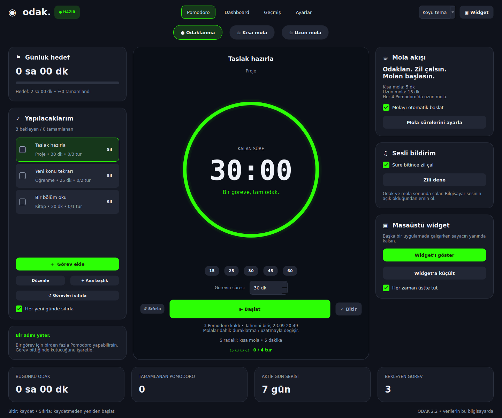
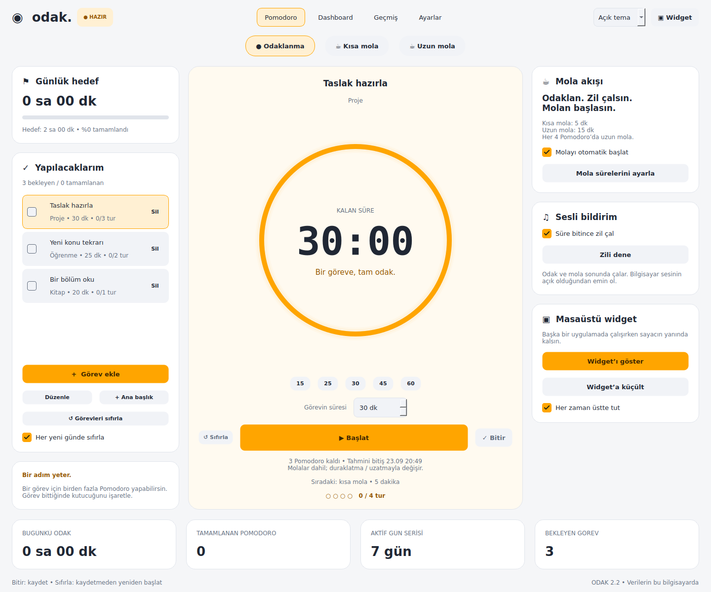
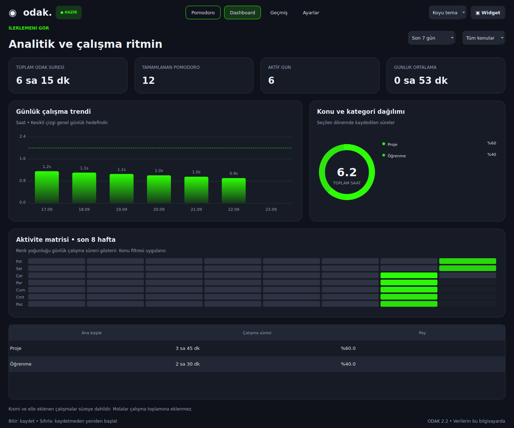
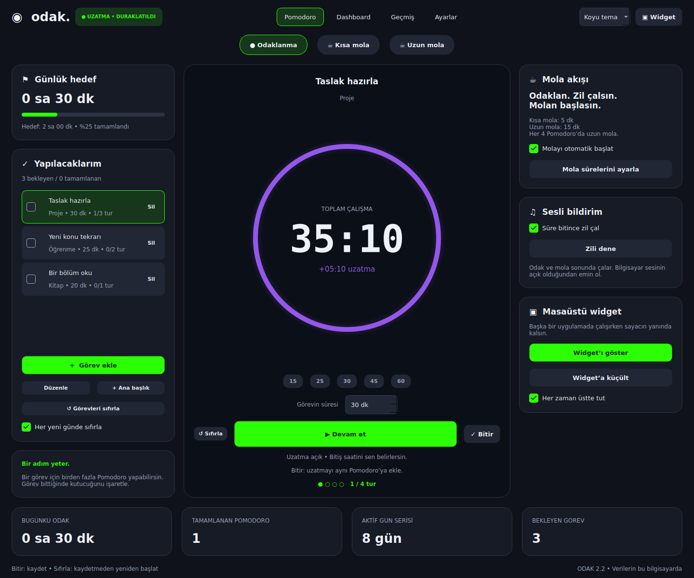

# Odak — Pomodoro ve Çalışma Günlüğü

**Odak**, görevlerini planlamak, Pomodoro oturumlarını yönetmek ve çalışma geçmişini takip etmek için geliştirilmiş Türkçe bir Windows masaüstü uygulamasıdır.

Python ve **PySide6 / Qt** ile geliştirilmiştir. Çalışma kayıtları cihaz üzerinde **SQLite** veritabanında tutulur; hesap, sunucu veya bulut bağlantısı gerektirmez.

> Sürüm: **2.2.0**  
> Platform: **Windows 10 / Windows 11 x64**

---

## Ekran Görüntüleri

| Koyu Tema | Açık Tema |
|---|---|
|  |  |

| Dashboard | Pomodoro Uzatma |
|---|---|
|  |  |

---

## Özellikler

- Görev oluşturma ve görevleri ana başlıklar altında gruplama
- Görev başına Pomodoro süresi ve hedef Pomodoro sayısı belirleme
- Planlanan çalışmaya göre tahmini bitiş saatini hesaplama
- Başlat / duraklat / devam et / bitir / sıfırla akışı
- Kısa ve uzun mola yönetimi
- İsteğe bağlı otomatik mola başlatma
- Pomodoro tamamlandıktan sonra aynı oturumu **uzatma**
- Günlük görev ilerlemelerini otomatik sıfırlama seçeneği
- Günlük çalışma hedefi
- Çalışma süresi ve oturum sayısı takibi
- Ana başlıklara göre çalışma dağılımı
- Bugün, son 7 gün, son 30 gün, bu ay ve tüm zamanlar raporları
- Çalışma geçmişinde arama ve filtreleme
- Geçmiş çalışma kaydını manuel ekleme
- CSV dışa aktarma
- SQLite veritabanı yedekleme
- Uygulama kapanınca yarım kalan oturumu koruma
- Her zaman üstte tutulabilen küçük masaüstü sayaç penceresi
- Açık ve koyu tema
- Pomodoro tamamlandığında sesli bildirim
- Yerel ve çevrimdışı veri saklama

---

## Teknolojiler

- **Python**
- **PySide6 / Qt**
- **SQLite**
- **PyInstaller**
- **unittest**
- Windows batch scripts
- Microsoft Store / MSIX hazırlama araçları

Ana çalışma bağımlılığı:

```txt
PySide6-Essentials==6.11.2
```

---

## Kurulum

### Kolay yöntem — Windows

Projeyi indirdikten sonra klasör içindeki:

```text
BASLAT.bat
```

dosyasını çalıştır.

İlk çalıştırmada proje için `.venv` sanal ortamı oluşturulur ve gerekli PySide6 paketi yüklenir. Sonraki kullanımlarda uygulama çevrimdışı çalışabilir.

### Manuel kurulum

Projeyi klonla:

```bash
git clone https://github.com/ozlemkilicc/odak-pomodoro.git
cd odak-pomodoro
```

Sanal ortam oluştur:

```bash
python -m venv .venv
```

Windows'ta etkinleştir:

```bash
.venv\Scripts\activate
```

Bağımlılıkları yükle:

```bash
pip install -r requirements.txt
```

Uygulamayı başlat:

```bash
python app.py
```

> `KULLANICI-ADIN` bölümünü kendi GitHub kullanıcı adınla değiştir.

---

## Windows EXE Oluşturma

Portable Windows sürümü oluşturmak için:

```text
EXE_OLUSTUR.bat
```

dosyasını çalıştır.

Derleme işlemi `requirements-build.txt` içindeki bağımlılıkları kullanır.

Başarılı derlemeden sonra çıktı şu yapıda oluşturulur:

```text
release/
└── 2.2.0.0-portable/
    └── OdakPomodoro/
        ├── OdakPomodoro.exe
        └── _internal/
```

`OdakPomodoro.exe` tek başına taşınmamalıdır. Portable sürümde `OdakPomodoro` klasörü bütün olarak korunmalıdır.

EXE derlemesi için projedeki mevcut akış **Python 3.13 x64** kullanacak şekilde hazırlanmıştır.

---

## Testler

Projede `unittest` tabanlı testler bulunur.

Tüm testleri çalıştırmak için:

```bash
python -m unittest discover -v
```

Başlıca test dosyaları:

```text
test_core.py
test_v2.py
test_v21.py
test_release.py
```

---

## Veriler Nerede Saklanır?

Odak, kullanıcı verilerini proje klasörünün dışında saklar.

Portable kullanımda veritabanı genellikle:

```text
%LOCALAPPDATA%\OdakPomodoro\odak.sqlite3
```

konumundadır.

Veritabanında kullanıcı tarafından oluşturulan:

- görevler,
- ana başlıklar,
- Pomodoro oturumları,
- çalışma süreleri,
- uygulama tercihleri

saklanır.

Bu veritabanı Git repository'sine dahil edilmemelidir ve `.gitignore` tarafından hariç tutulur.

---

## Gizlilik

Odak için:

- hesap oluşturmak gerekmez,
- uygulamanın kendi backend'i yoktur,
- analitik veya kullanıcı takibi yapılmaz,
- reklam bileşeni bulunmaz,
- çalışma kayıtları geliştiriciye gönderilmez,
- bulut eşitleme yapılmaz.

Veriler yerel SQLite veritabanında tutulur.

Daha ayrıntılı bilgi için:

[`GIZLILIK.txt`](GIZLILIK.txt)

---

## Proje Yapısı

```text
OdakPomodoro/
├── app.py
├── core.py
├── modern.py
│
├── alarm.wav
├── check.svg
│
├── requirements.txt
├── requirements-build.txt
│
├── BASLAT.bat
├── EXE_OLUSTUR.bat
├── STORE_HAZIRLA.bat
│
├── build_assets.py
├── build_release.py
│
├── test_core.py
├── test_v2.py
├── test_v21.py
├── test_release.py
│
├── GIZLILIK.txt
├── THIRD_PARTY_NOTICES.txt
├── STORE_YAYIN_REHBERI.md
│
└── store/
    ├── Assets/
    ├── previews/
    ├── AppxManifest.template.xml
    ├── store-config.example.json
    ├── build_icons.py
    ├── build_privacy.py
    ├── capture_screenshots.py
    └── prepare_sources.py
```

---

## Microsoft Store

Projede Microsoft Store / MSIX paketleme için hazırlanmış ek araçlar bulunmaktadır.

Başlangıç noktası:

```text
STORE_HAZIRLA.bat
```

Ayrıntılı süreç için:

[`STORE_YAYIN_REHBERI.md`](STORE_YAYIN_REHBERI.md)

Store'a özgü gerçek yayıncı bilgilerini içerebilecek:

```text
store/store-config.json
```

dosyası repository'ye eklenmemelidir.

Bunun yerine örnek yapı:

```text
store/store-config.example.json
```

repository'de tutulabilir.

---

## Derleme Dosyaları

Repository'de kaynak kod tutulur. Aşağıdaki klasör ve çıktılar Git'e eklenmez:

```text
.venv/
.build-env/
build/
dist/
release/
source-cache/
LICENSES/
```

Ayrıca kullanıcı verileri ve derlenmiş paketler de hariç tutulur:

```text
*.sqlite3
*.db
*.csv
*.exe
*.msix
```

Bunların tamamı proje kökündeki `.gitignore` dosyasında tanımlanmıştır.

---

## Üçüncü Taraf Bileşenler

Uygulamanın kullandığı üçüncü taraf bileşenler ve ilgili lisans bildirimleri için:

[`THIRD_PARTY_NOTICES.txt`](THIRD_PARTY_NOTICES.txt)

dosyasına bakabilirsiniz.

---

## Durum

Odak 2.2; Windows masaüstünde günlük kullanım, görev planlama, Pomodoro takibi, çalışma geçmişi ve raporlama amacıyla geliştirilmektedir.

Yeni kurulum boş bir çalışma alanıyla başlar. Repository kullanıcıya ait kişisel Pomodoro kayıtlarını veya yerel veritabanını içermez.
